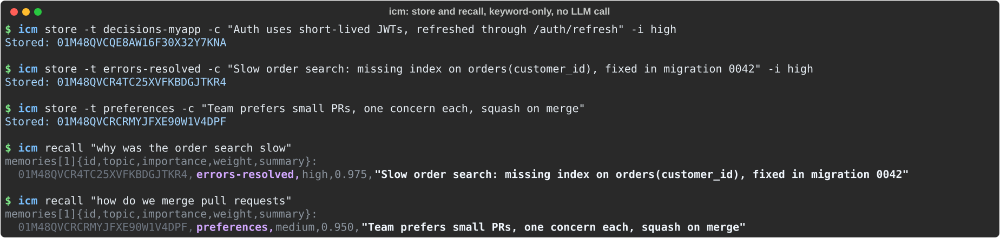

[English](README.md) | [Français](README_fr.md) | [Español](README_es.md) | [Deutsch](README_de.md) | [Italiano](README_it.md) | [Português](README_pt.md) | [Nederlands](README_nl.md) | [Polski](README_pl.md) | [Русский](README_ru.md) | [日本語](README_ja.md) | [中文](README_zh.md) | [العربية](README_ar.md) | [한국어](README_ko.md)

Dit is een vertaling van README.md (Engels), dat de referentie is; als ze verschillen, is de Engelse versie de juiste.

<h1 align="center">ICM</h1>

<p align="center">
  <b>Langetermijngeheugen voor AI-codeeragents, gedeeld tussen je tools.</b><br>
  Eén binary, één SQLite-bestand. Geen LLM-aanroep om een herinnering op te slaan of op te halen.
</p>

<p align="center">
  <a href="https://github.com/rtk-ai/icm/actions/workflows/ci.yml"></a>
  <a href="https://github.com/rtk-ai/icm/releases/latest"></a>
  <a href="LICENSE"></a>
</p>

Vertel Claude Code op maandag hoe je project met authenticatie omgaat, en de Gemini CLI-sessie van dinsdag weet het al. ICM bewaart wat je codeeragents leren (beslissingen, fixes, conventies, voorkeuren) in één SQLite-bestand op je machine, en geeft het relevante deel terug aan het begin van elke sessie en bij elke prompt die je stuurt. Tot 18 agents en editors delen dat geheugen, zodat je je project niet steeds opnieuw hoeft uit te leggen wanneer je een sessie opent of van tool wisselt.

- **92.8% op LoCoMo (1,540 vragen), gelijk met Hindsight (92.0%)**, met een derde minder context per vraag. [Details en kanttekeningen hieronder](#benchmark-comparison).
- **Geen LLM-aanroep om op te slaan of op te halen.** Hindsight, Mem0, Graphiti (Zep) en claude-mem roepen standaard een LLM aan voor elke herinnering die ze opslaan. ICM niet. Alleen de automatische extractie van feiten uit tool-uitvoer loopt via de LLM-commandlinetool die je al gebruikt, als er een geïnstalleerd is; `provider = "none"` houdt ook dat lokaal (zie [Snel aan de slag](#quickstart)).
- **Bruikbaar zonder embeddingmodel.** Alleen al de recall op trefwoorden zet voor 88.6% van de LoCoMo-vragen minstens één van de juiste sessies in de top 5, met een mediaan van 6.8 ms per recall op Linux x86-64.
- **Niet overal voorop.** Op PersonaMem (de veranderende voorkeuren van een gebruiker) loopt Hindsight voor: 86.6% tegenover 82.9% voor ICM.

<p align="center">
  
</p>

<a id="quickstart"></a>

## Snel aan de slag

```bash
brew tap rtk-ai/tap && brew install icm    # or: curl -fsSL https://raw.githubusercontent.com/rtk-ai/icm/main/install.sh | sh
icm init                                   # instructions, skills and hooks for every agent it detects
```

Dat is de hele installatie. Open een nieuwe sessie in Claude Code, Codex, Gemini CLI of Copilot CLI: je agent start nu met een kort pakket van zijn belangrijkste herinneringen en krijgt bij elke prompt die je stuurt de relevante herinneringen mee. Wat hij uit de uitvoer van zijn tools leert, komt in een wachtrij, en die wachtrij wordt aan het einde van elke Claude Code-sessie omgezet in herinneringen; bij de andere tools voer je `icm extract-pending` uit (bijvoorbeeld vanuit een cronjob).

Opslaan en ophalen blijven op je machine. De automatische extractie geeft tekst door aan de LLM-commandlinetool die je al gebruikt (Claude Code, Codex of Gemini CLI), als er een geïnstalleerd is; zet `provider = "none"` onder `[extraction.summarizer]` om alles volledig lokaal te houden.

Om het meteen te zien werken, sla je handmatig op en haal je handmatig op:

```console
$ icm store -t decisions-myapp -c "Auth uses short-lived JWTs, refreshed through /auth/refresh" -i high
Stored: 01M47YY6CHVZ48BYKQRCRNZTCF

$ icm recall "how does auth work"
memories[1]{id,topic,importance,weight,summary}:
  01M47YY6CHVZ48BYKQRCRNZTCF,decisions-myapp,high,0.975,"Auth uses short-lived JWTs, refreshed through /auth/refresh"
```

Bij de eerste keer opslaan of ophalen met semantisch zoeken wordt het meertalige embeddingmodel eenmalig gedownload (`Qdrant/multilingual-e5-large-onnx`, ongeveer 2 GB). Om ICM zonder dat model te proberen, voeg je `--no-embeddings` toe (recall op trefwoorden, zoals in de uitvoer hierboven) of kies je een lichter model in de config. `icm init` schrijft hooks en instructies in de configuratie van elke gedetecteerde agent; `icm uninstall --dry-run` laat zien hoe je ze verwijdert. Windows, Linux, Nix en bouwen vanuit de broncode: [Installatie](#install).

<a id="benchmark-comparison"></a>

## Benchmarkvergelijking

Nauwkeurigheid van antwoorden op [LoCoMo](https://github.com/snap-research/locomo) (10 lange gesprekken, 1,540 vragen), gemeten met de openbare [Agent Memory Benchmark](https://github.com/vectorize-io/agent-memory-benchmark)-harness: het geheugensysteem haalt context op, `gemini-3.1-pro-preview` antwoordt op basis daarvan, `gemini-2.5-flash-lite` beoordeelt het antwoord.

| Systeem | Nauwkeurigheid LoCoMo | Context per vraag | LLM-aanroepen om een herinnering op te slaan | Draait als | Resultaat |
|--------|:---------------:|:--------------------:|:---------------------------:|---------|--------|
| **ICM** 0.10.65 (recall-engine v2) | **92.8%** (1,429 / 1,540) | 24.1k tokens | geen | één Rust-binary, SQLite-bestand | onze run, 2026-10-05 |
| Hindsight | 92.0% (1,417 / 1,540) | 36.2k tokens | feitenextractie via LLM | Python-service, PostgreSQL + pgvector | gepubliceerd door de harness |
| Baseline hybride zoeken (dense + sparse, RRF) | 79.1% (1,218 / 1,540) | 22.2k tokens | geen | Qdrant | gepubliceerd door de harness |

Op [PersonaMem](https://arxiv.org/abs/2504.14225) 32k (589 meerkeuzevragen over de veranderende voorkeuren van een gebruiker, zelfde harness en zelfde antwoordmodel, gescoord op overeenkomst van de letter):

| Systeem | Nauwkeurigheid PersonaMem | Context per vraag | Resultaat |
|--------|:-------------------:|:--------------------:|--------|
| **ICM** 0.10.65 (recall-engine v2) | **82.9%** (488 / 589) | 16.2k tokens | onze run, 2026-10-05 |
| Hindsight | 86.6% (510 / 589) | 15.8k tokens | gepubliceerd door de harness |
| Baseline hybride zoeken | 84.4% (497 / 589) | 24.2k tokens | gepubliceerd door de harness |

Alleen retrieval, op LoCoMo, zonder antwoordmodel: het aandeel vragen waarvoor minstens één gold-sessie bij de topresultaten zit. Dit is het bewijs voor de recall-engine zelf. De v2-runs kregen de datum van elke sessie en de datum van de vraag; de vorige engine heeft geen datuminvoer, dus zijn runs kregen er geen.

| Topresultaten | Vorige engine (`legacy`) | Recall-engine v2 | Vorige engine, zonder embeddingmodel | Recall-engine v2, zonder embeddingmodel |
|:-----------:|:--------------:|:----------------:|:--------------:|:----------------:|
| 5 | 76.5% | **86.7%** | 12.0% | **88.6%** |
| 10 | 83.0% | **93.3%** | 17.4% | **94.2%** |
| 20 | 87.7% | **97.9%** | 29.8% | **97.5%** |

Wat deze cijfers wel en niet laten zien:

- **ICM en Hindsight staan gelijk op LoCoMo.** Het verschil van 0.8 punt is 12 vragen, binnen de steekproeffout (95%-interval voor ICM: 91.5 tot 94.1). ICM haalt dat met een derde minder context en zonder een LLM aan te roepen wanneer een herinnering wordt opgeslagen.
- **Op PersonaMem loopt Hindsight voor**, met 3.7 punten; ICM staat gelijk met de baseline voor hybride zoeken (95%-interval voor ICM: 79.8 tot 85.9) en leest daarbij een derde minder context. De zwakste categorie van ICM is daar het voorstellen van nieuwe ideeën op basis van bekende voorkeuren (59.1%).
- **Geen identieke omstandigheden.** De harness wordt onderhouden door Vectorize, de leverancier van Hindsight. De gepubliceerde LoCoMo-resultaten dateren van vóór een wijziging die de temperatuur van antwoord en beoordelaar op 0 zette; onze run gebruikt de huidige harness (commit `f618ed7`) en Vertex AI.
- **Bij 50 chunks wordt een groot deel van elk gesprek teruggegeven,** dus deze nauwkeurigheid meet ook het antwoordmodel. De retrievaltabel is het bewijs voor de recall-engine zelf.
- **Tot nu toe één run per dataset.** De 95%-intervallen hierboven dekken de steekproef van vragen, niet de variatie van de ene run naar de andere.

<details>
<summary>Resultaten per categorie, latentie en verdere kanttekeningen</summary>

- **Per vraagtype** (LoCoMo, labels van de harness): open-domain 96.7% (813 / 841), temporal 91.0% (292 / 321), single-hop 89.0% (251 / 282), multi-hop 76.0% (73 / 96).
- **Latentie.** Mediane recall-latentie van 141 ms op een cloud-VM met 4 vCPU's tijdens de run hierboven; 272 sessies ingelezen zonder LLM-aanroep. In de runs met alleen retrieval op Linux x86-64: mediaan 136 ms met embeddings, 6.8 ms met alleen trefwoorden.
- **Sessiedatums.** De benchmarkadapter schrijft de datum van elke sessie in de herinneringstekst van ICM; Hindsight krijgt dezelfde datums als metadata, en elk systeem krijgt de datum van de vraag.
- **De zwakste categorie is die van de 96 vragen die de harness als multi-hop labelt** (76.0%). Categorienamen komen tussen benchmarks niet overeen: andere LoCoMo-evaluaties noemen deze categorie open-domain, en noemen de 282 vragen die de harness als single-hop labelt multi-hop (hier 89.0%). Vergelijk op aantal vragen, niet op label.
- **Recall-engine v2 is de standaard** voor `icm recall`, de MCP-tool `icm_memory_recall`, HTTP `/recall` en de prompt-hook. De vorige engine blijft beschikbaar om terug te gaan of om te vergelijken: `icm recall --engine legacy`, `"engine": "legacy"` op HTTP `/recall`, of `ICM_RECALL_ENGINE=legacy`.

</details>

De resultaten per vraag voor beide datasets staan in [`bench/amb/results/`](bench/amb/results/); de adapter, de exacte instellingen en de commando's om alles te reproduceren staan in [`bench/amb/README.md`](bench/amb/README.md).

<a id="one-memory-for-every-tool"></a>

## Eén geheugen voor elke tool

Elke tool die door `icm init` is geconfigureerd, leest en schrijft dezelfde SQLite-database, en topics (`decisions-myapp`, `preferences`, `errors-resolved`, ...) zijn niet per tool gescheiden. Een herinnering die vanuit Claude Code is opgeslagen, is meteen zichtbaar voor Codex, Gemini, Cursor, Roo, Amp, Aider, ...

Liever isolatie? `icm init --per-project` maakt een projectlokale database aan onder `.icm/` (en schrijft de instructiebestanden van de agents, zoals `CLAUDE.md` en `AGENTS.md`, in de huidige map); `--db <path>` of `ICM_DB` verwijzen naar elk ander bestand. Elk pad is een onafhankelijk corpus.

> **Projectstatus: bèta.** ICM is pre-1.0: brekende wijzigingen kunnen in elke minor release terechtkomen, en de configuratieformaten van hooks en MCP kunnen veranderen. Bèta gaat over de stabiliteit van de API, niet over de dagelijkse bruikbaarheid: ik (de maintainer) gebruik ICM elke dag als mijn primaire geheugen bij het programmeren met AI. Mijn hoofdfocus is [rtk](https://github.com/rtk-ai/rtk), dus issues en pull requests worden bekeken wanneer de tijd het toelaat.
>
> Apache-2.0, geleverd **zoals het is, zonder enige garantie** (zie [LICENSE](LICENSE)). Voer vóór elke destructieve bewerking eerst de alleen-lezen-variant uit (`icm uninstall --dry-run`, `icm uninstall --check`).

<a id="install"></a>

## Installatie

```bash
# macOS / Linux, Homebrew
brew tap rtk-ai/tap && brew install icm

# macOS / Linux, script (verifies SHA256 against the release checksums)
curl -fsSL https://raw.githubusercontent.com/rtk-ai/icm/main/install.sh | sh

# Windows, PowerShell
irm https://raw.githubusercontent.com/rtk-ai/icm/main/install.ps1 | iex
```

Zoeken op trefwoorden werkt overal. Voer `icm embeddings status` uit om te zien of semantisch zoeken aan staat: het is ingebouwd in de builds voor macOS Apple Silicon, Windows en `.rpm`; de Linux glibc-archieven en de `.deb` hebben eenmaal `icm embeddings download` nodig; de build voor Intel-Macs heeft je eigen ONNX Runtime nodig (`ORT_DYLIB_PATH`); de statische Linux musl-build ondersteunt alleen trefwoorden. Nix, bouwen vanuit de broncode, versies vastzetten en de details: [referentie](docs/reference.md#install).

<a id="setup"></a>

## Configuratie

```bash
icm init                  # global database, every detected agent
icm init --per-project    # database under .icm/ at the git root
icm init --mode all       # also register the MCP server in every tool that supports it
```

De standaardmodus (`standard`) schrijft instructies, skills en hooks, zonder MCP-server. `--mode all` voegt de MCP-server toe; daarmee (plus `--per-project` voor Aider, waarvan het conventiesbestand per project is) zijn de 18 tools hieronder gedekt ([integratiegids](docs/integrations.md)):

| Tool | MCP-server | Hooks |
|------|:---:|:-----:|
| Claude Code | ja | ja |
| Claude Desktop | ja | — |
| Gemini CLI | ja | ja |
| Codex CLI | ja | ja |
| Copilot CLI | ja | ja |
| Cursor | ja | — |
| Windsurf | ja | — |
| VS Code | ja | — |
| Amp | ja | — |
| Amazon Q | ja | — |
| Cline | ja | — |
| Roo Code | ja | — |
| Kilo Code | ja | — |
| Zed | ja | — |
| OpenCode | ja | ja |
| Continue.dev | ja | — |
| Aider | — | — |
| Pi | — | — |

Of registreer de MCP-server handmatig: `claude mcp add icm -- icm serve` (elke MCP-client: commando `icm`, argumenten `["serve"]`).

Wat de hooks doen:

| Hook | Wat hij doet |
|------|-------------|
| `icm hook start` | Voegt aan het begin van de sessie een wake-up-pakket met critical/high-herinneringen in (~500 tokens) |
| `icm hook pre` | Staat `icm`-CLI-commando's automatisch toe (geen toestemmingsvraag) |
| `icm hook post` | Haalt elke N aanroepen feiten uit tool-uitvoer (automatische extractie) |
| `icm hook compact` | Haalt herinneringen uit het transcript vóór contextcompressie |
| `icm hook prompt` | Voegt opgehaalde context in aan het begin van elke gebruikersprompt |

Hooktabellen per tool, skills, instructiebestanden en de opmerking over Codex: [referentie](docs/reference.md#setup).

<a id="use"></a>

## Gebruik

```bash
# Store
icm store -t "my-project" -c "Use PostgreSQL for the main DB" -i high -k "db,postgres"

# Recall
icm recall "database choice"
icm recall "auth setup" --topic "my-project" --limit 10
icm recall "architecture" --keyword "postgres"

# Manage
icm forget <memory-id>
icm consolidate --topic "my-project"
icm topics
icm stats

# Extract facts from text (rule-based, no LLM call)
echo "The parser uses Pratt algorithm" | icm extract -p my-project
```

ICM bewaart ook **memoirs** (permanente kennisgrafen van concepten en getypeerde relaties), **feedback** (correcties om van te leren) en **letterlijke transcripten**, en biedt **31 MCP-tools** (30 zonder embeddingmodel), een **HTTP-API** die het embeddingmodel geladen houdt en een **terminaldashboard** (`icm dashboard`). Alles staat in de [referentie](docs/reference.md).

<a id="how-it-works"></a>

## Hoe het werkt

Recall voegt tot drie gerangschikte lijsten samen via reciprocal rank fusion (RRF): trefwoordmatching met **FTS5 BM25**, altijd aan; **semantisch vectorzoeken** via sqlite-vec wanneer een embeddingmodel geladen is (standaard `Qdrant/multilingual-e5-large-onnx`, 1024 dimensies, 100+ talen); en een **datumvenster** wanneer de zoekopdracht een periode noemt ("last week", "in March 2024"). Filters op project, topic en trefwoord worden vóór de afkapping toegepast. Herinneringen vervagen na verloop van tijd volgens hun belang (`critical` vervaagt nooit); met een geladen embeddingmodel wordt een nieuwe herinnering die bijna identiek is aan een andere in hetzelfde topic (cosinusgelijkenis boven 0.95) daarmee samengevoegd; en het model dat de opgeslagen vectoren heeft gemaakt, wordt in de database vastgelegd, zodat het wijzigen van `model` in de config ze nooit wist (`icm embed --migrate` is de expliciete manier om te wisselen).

Alles staat in één SQLite-bestand, zonder externe service:

```
~/Library/Application Support/dev.icm.icm/memories.db     # macOS
~/.local/share/icm/memories.db                            # Linux
%APPDATA%\icm\icm\data\memories.db                        # Windows
<project-root>/.icm/memories.db                           # icm init --per-project
```

`icm config` toont de actieve configuratie; [config/default.toml](config/default.toml) somt alle opties op. Details: [referentie](docs/reference.md#how-it-works).

<a id="documentation"></a>

## Documentatie

| Document | Beschrijving |
|----------|-------------|
| [Integratiegids](docs/integrations.md) | MCP-configuratie per tool: Claude Code, Cursor, Windsurf, Zed, Amp, Codex, Cline, Roo Code, enz. |
| [Technische architectuur](docs/architecture.md) | Cratestructuur, zoekpipeline, decaymodel, sqlite-vec-integratie, testen |
| [Gebruikershandleiding](docs/guide.md) | Installatie, organisatie van topics, consolidatie, extractie, probleemoplossing |
| [Productoverzicht](docs/product.md) | Toepassingen, benchmarks, vergelijking met alternatieven |
| [Referentie](docs/reference.md) | Installatieopties, configuratie per tool, CLI, 31 MCP-tools, HTTP-API, dashboard, interne werking |
| [Benchmarkadapter](bench/amb/README.md) | Hoe de vergelijking hierboven is uitgevoerd en hoe je die reproduceert |
| [Demonstraties](docs/demonstrations.md) | Opslag-microbenchmarks en kleine demo's |

<a id="license"></a>

## Licentie

[Apache-2.0](LICENSE)
